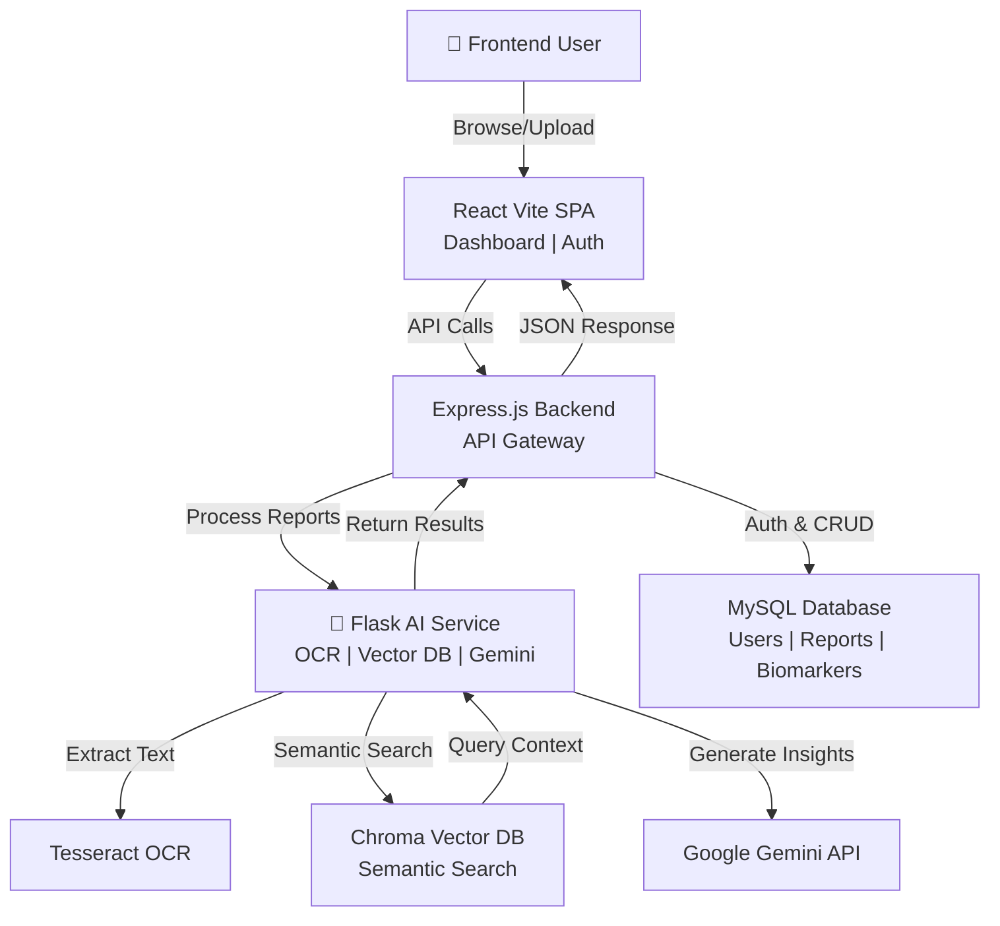
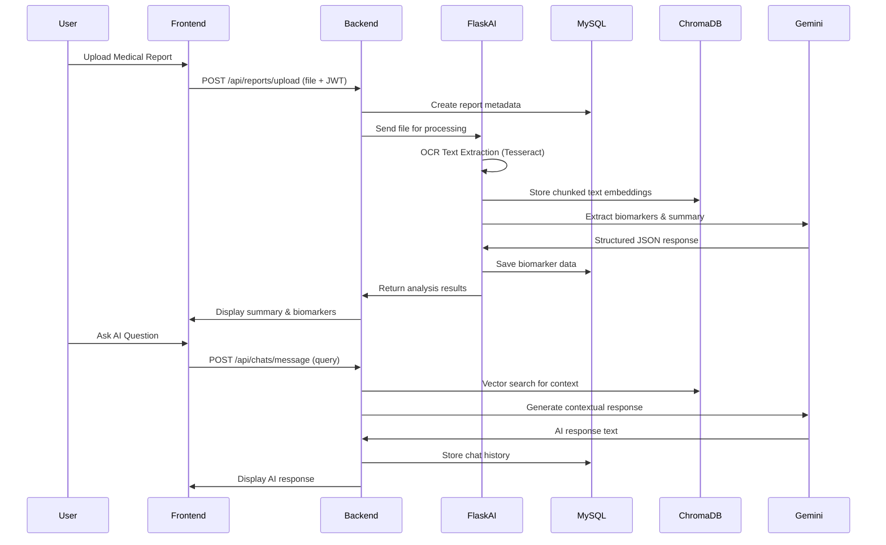

# MedIntel - Medical Report Intelligence System

A full-stack AI-powered medical report analysis platform that leverages OCR, vector embeddings, and generative AI to extract insights from medical documents. The system enables healthcare professionals and patients to upload medical reports, analyze biomarkers, and have conversational interactions with an AI assistant about their medical data.

---

## 🎯 Project Overview

**MedIntel** is a comprehensive medical intelligence system designed to:
- **Digitize Medical Reports**: Convert medical document images (JPEG, PNG, PDF) into searchable text using OCR
- **Extract Structured Data**: Parse and organize biomarkers and clinical measurements
- **Provide AI-Powered Analysis**: Generate intelligent summaries and insights using Google Gemini API
- **Enable Conversational Interface**: Allow users to ask questions about their medical reports via vector-based semantic search
- **Secure User Management**: Implement JWT-based authentication and role-based access control

---

## 🏗️ System Architecture

### High-Level Architecture Flow



### Component Interaction Diagram



---

## 📁 Directory Structure

```
MEDINTEL-MINIPROJECT/
├── README.md                          # Project documentation (this file)
├── .env                               # Environment variables (create manually)
├── .env.example                       # Example environment variables
│
├── ai-service/                        # Python Flask AI Microservice
│   ├── app.py                         # Main Flask application
│   ├── requirements.txt               # Python dependencies
│   └── chroma_db/                     # Vector database storage
│       └── chroma.sqlite3             # Persistent ChromaDB file
│
├── backend/                           # Node.js Express Backend API
│   ├── server.js                      # Main server entry point
│   ├── package.json                   # Node dependencies & scripts
│   ├── package-lock.json              # Dependency lock file
│   ├── .env                           # Backend environment variables
│   │
│   ├── config/
│   │   └── db.js                      # MySQL connection pool configuration
│   │
│   ├── middleware/
│   │   └── auth.js                    # JWT authentication middleware
│   │
│   ├── routes/
│   │   ├── auth.js                    # User registration & login endpoints
│   │   ├── reports.js                 # Medical report upload & processing
│   │   └── chats.js                   # Conversational AI endpoints
│   │
│   └── uploads/                       # Local file storage directory
│       └── (uploaded medical files)   # Stores user-uploaded documents
│
├── frontend/                          # React + Vite Frontend Application
│   ├── index.html                     # HTML entry point
│   ├── package.json                   # Frontend dependencies & scripts
│   ├── package-lock.json              # Dependency lock file
│   ├── vite.config.js                 # Vite bundler configuration
│   ├── postcss.config.js              # PostCSS configuration
│   ├── tailwind.config.js             # Tailwind CSS configuration
│   │
│   ├── public/                        # Static assets
│   │   └── (favicon, static images)
│   │
│   └── src/
│       ├── main.jsx                   # Vite entry point
│       ├── App.jsx                    # Main React router component
│       ├── index.css                  # Global styles
│       │
│       ├── components/
│       │   ├── Navbar.jsx             # Navigation header component
│       │   └── ProtectedRoute.jsx     # Route authentication wrapper
│       │
│       └── pages/
│           ├── Login.jsx              # User login page
│           ├── Register.jsx           # User registration page
│           ├── Dashboard.jsx          # Main report management dashboard
│           ├── ReportAnalysis.jsx     # Detailed report analysis view
│           └── ChatSession.jsx        # AI conversational interface
```

---

## 🔧 Technology Stack

### Frontend
- **React 18.3.1** - UI component library
- **Vite 5.2.11** - Modern build tool & dev server
- **React Router 6.23.1** - Client-side routing
- **Tailwind CSS 3.4.3** - Utility-first styling
- **Axios 1.6.8** - HTTP client for API calls
- **PostCSS** - CSS processing

### Backend
- **Node.js + Express 4.19.2** - REST API framework
- **MySQL2 3.9.7** - Database client (connection pooling)
- **JWT (jsonwebtoken 9.0.2)** - Authentication tokens
- **Bcryptjs 2.4.3** - Password hashing
- **Multer 1.4.5** - File upload middleware
- **Axios 1.6.8** - HTTP client for Flask communication
- **CORS 2.8.5** - Cross-Origin Resource Sharing
- **Dotenv 16.4.5** - Environment variable management
- **Nodemon 3.1.0** - Development auto-reload

### AI Service (Python)
- **Flask 3.0.2** - Lightweight web framework
- **Flask-CORS 4.0.0** - CORS support
- **Tesseract-OCR** - Optical Character Recognition via pytesseract 0.3.10
- **PDF2Image 1.17.0** - PDF to image conversion
- **Pillow 10.2.0** - Image processing
- **ChromaDB** - Vector embedding database
- **Sentence-Transformers 2.5.1** - Text embedding model (all-MiniLM-L6-v2)
- **Google GenAI** - Gemini API for AI responses
- **Python-dotenv 1.0.1** - Environment configuration

### Databases
- **MySQL** - Relational database for user & report metadata
- **ChromaDB** - Vector database for semantic search

---

## 📋 Prerequisites

### System Requirements
- **Node.js** v16.0.0 or higher
- **Python** v3.8 or higher
- **MySQL Server** v5.7 or higher
- **Tesseract-OCR** (Windows: install from https://github.com/UB-Mannheim/tesseract)
- **Poppler** (for PDF processing - Windows: https://github.com/oschwartz10612/poppler-windows)

### API Keys & Credentials Required
- **Google Gemini API Key** - Register at https://ai.google.dev
- **MySQL Database** - Local or remote MySQL instance
- **JWT_SECRET** - Random string for token signing

### System Path Configuration (Windows)
```
Tesseract Path: C:\Program Files\Tesseract-OCR\tesseract.exe
Poppler Path: C:\Program Files\poppler\bin
```

---

## 🚀 Installation & Setup

### Step 1: Clone & Navigate to Project

```bash
cd d:\Projects\MedIntel - MiniProject
```

### Step 2: Setup Database

Create MySQL database and tables:

```sql
-- Create database
CREATE DATABASE medintel;
USE medintel;

-- Users table
CREATE TABLE users (
    id INT AUTO_INCREMENT PRIMARY KEY,
    name VARCHAR(255) NOT NULL,
    email VARCHAR(255) UNIQUE NOT NULL,
    password VARCHAR(255) NOT NULL,
    created_at TIMESTAMP DEFAULT CURRENT_TIMESTAMP
);

-- Reports table
CREATE TABLE reports (
    id INT AUTO_INCREMENT PRIMARY KEY,
    user_id INT NOT NULL,
    report_name VARCHAR(255),
    file_path VARCHAR(255),
    uploaded_at TIMESTAMP DEFAULT CURRENT_TIMESTAMP,
    FOREIGN KEY (user_id) REFERENCES users(id) ON DELETE CASCADE
);

-- Biomarkers table
CREATE TABLE biomarkers (
    id INT AUTO_INCREMENT PRIMARY KEY,
    report_id INT NOT NULL,
    test_name VARCHAR(255),
    value FLOAT,
    unit VARCHAR(50),
    reference_min FLOAT,
    reference_max FLOAT,
    FOREIGN KEY (report_id) REFERENCES reports(id) ON DELETE CASCADE
);

-- Chats table
CREATE TABLE chats (
    id INT AUTO_INCREMENT PRIMARY KEY,
    user_id INT NOT NULL,
    report_id INT NOT NULL,
    created_at TIMESTAMP DEFAULT CURRENT_TIMESTAMP,
    FOREIGN KEY (user_id) REFERENCES users(id) ON DELETE CASCADE,
    FOREIGN KEY (report_id) REFERENCES reports(id) ON DELETE CASCADE
);

-- Messages table
CREATE TABLE messages (
    id INT AUTO_INCREMENT PRIMARY KEY,
    chat_id INT NOT NULL,
    sender ENUM('user', 'ai'),
    message_text LONGTEXT,
    timestamp TIMESTAMP DEFAULT CURRENT_TIMESTAMP,
    FOREIGN KEY (chat_id) REFERENCES chats(id) ON DELETE CASCADE
);
```

### Step 3: Setup AI Service (Flask)

```bash
cd ai-service

# Create Python virtual environment
python -m venv venv

# Activate virtual environment
# On Windows:
venv\Scripts\activate
# On macOS/Linux:
source venv/bin/activate

# Install Python dependencies
pip install -r requirements.txt

# Create .env file
echo GEMINI_API_KEY=your_actual_gemini_api_key_here > .env
echo FLASK_ENV=development >> .env
echo FLASK_PORT=5001 >> .env
```

### Step 4: Setup Backend (Express.js)

```bash
cd backend

# Install Node dependencies
npm install

# Create .env file
echo DB_HOST=localhost > .env
echo DB_PORT=3306 >> .env
echo DB_USER=root >> .env
echo DB_PASSWORD=your_password >> .env
echo DB_NAME=medintel >> .env
echo JWT_SECRET=your_super_secret_jwt_key_12345 >> .env
echo AI_SERVICE_URL=http://localhost:5001 >> .env
echo PORT=5000 >> .env
```

### Step 5: Setup Frontend (React)

```bash
cd frontend

# Install Node dependencies
npm install

# Create .env file
echo VITE_API_BASE_URL=http://localhost:5000/api > .env
echo VITE_AI_SERVICE_URL=http://localhost:5001 >> .env
```

---

## ▶️ Running the Project

### Terminal 1: Start AI Service (Flask)

```bash
cd ai-service

# Activate virtual environment (if not already active)
venv\Scripts\activate  # Windows

# Start Flask server
python app.py

# Expected output:
# FLASK SERVER: Running on http://localhost:5001
```

### Terminal 2: Start Backend (Express.js)

```bash
cd backend

# Start development server
npm run dev

# Expected output:
# MEDINTEL BACKEND CORE: Running seamlessly on http://localhost:5000
```

### Terminal 3: Start Frontend (React)

```bash
cd frontend

# Start Vite development server
npm run dev

# Expected output:
# VITE v5.2.11 ready in 234 ms
# Local: http://localhost:5173
```

### Access the Application

Open your browser and navigate to:
```
http://localhost:5173
```

---

## 🔐 Authentication Flow

### User Registration
```
1. User fills registration form (name, email, password)
2. Frontend POST /api/auth/register with credentials
3. Backend validates input & checks duplicate email
4. Backend hashes password with bcryptjs (salt rounds: 10)
5. User saved to MySQL users table
6. JWT token generated with userId & 7-day expiration
7. Token stored in localStorage on frontend
```

### User Login
```
1. User provides email & password
2. Frontend POST /api/auth/login
3. Backend queries users table by email
4. Backend compares password hash with bcrypt
5. JWT token generated on successful match
6. Token stored in localStorage
7. User redirected to dashboard
```

### Protected Endpoints
```
1. Frontend includes token in Authorization header: "Bearer <JWT_TOKEN>"
2. Backend authMiddleware validates token signature
3. Decoded userId injected into req.user object
4. Route handler proceeds with authenticated user context
5. If token invalid/expired: 401 Unauthorized response
```

---

## 📊 API Endpoints Reference

### Authentication Endpoints

#### POST `/api/auth/register`
Register a new user account
- **Body**: `{ name: string, email: string, password: string }`
- **Response**: `{ token: JWT, user: { id, name, email } }`

#### POST `/api/auth/login`
Authenticate and receive session token
- **Body**: `{ email: string, password: string }`
- **Response**: `{ token: JWT, user: { id, name, email } }`

### Report Endpoints

#### POST `/api/reports/upload`
Upload and analyze a medical report
- **Headers**: `Authorization: Bearer <JWT_TOKEN>`
- **Body**: `FormData { file: File }`
- **Response**: `{ report_id: number, summary: string, biomarkers: array }`

#### GET `/api/reports`
Fetch user's uploaded reports
- **Headers**: `Authorization: Bearer <JWT_TOKEN>`
- **Response**: `[{ id, report_name, uploaded_at, ... }]`

### Chat Endpoints

#### POST `/api/chats/message`
Send query to AI assistant about a report
- **Headers**: `Authorization: Bearer <JWT_TOKEN>`
- **Body**: `{ report_id: number, message: string }`
- **Response**: `{ chat_id: number, user_message: string, ai_response: string }`

#### GET `/api/chats/history/:report_id`
Fetch conversation history for a report
- **Headers**: `Authorization: Bearer <JWT_TOKEN>`
- **Response**: `[{ sender: 'user'|'ai', message_text: string, timestamp: date }]`

---

## 🧠 Component Workflow & Data Flow

### 1. Medical Report Upload Workflow

```
Dashboard Component
    ├─ User selects file
    ├─ FormData created with file + JWT token
    ├─ POST /api/reports/upload
    │
Backend (reports.js)
    ├─ auth middleware validates JWT
    ├─ multer saves file to backend/uploads/
    ├─ Creates report record in MySQL
    ├─ Streams file to Flask /process-report
    │
Flask AI Service (app.py)
    ├─ Receives file + report_id
    ├─ Tesseract OCR extracts text
    ├─ Splits text into chunks (4-line groups)
    ├─ Generates embeddings using SentenceTransformer
    ├─ Stores embeddings in ChromaDB collection
    ├─ Uses Gemini API to parse biomarkers & summary
    ├─ Returns parsed_biomarkers JSON + summary text
    │
Backend (reports.js)
    ├─ Receives AI response
    ├─ Parses biomarkers JSON array
    ├─ Saves each biomarker to MySQL biomarkers table
    ├─ Returns response to frontend
    │
Frontend (Dashboard)
    ├─ Displays success message
    ├─ Shows biomarkers table
    ├─ Refreshes reports list
    └─ User can now chat about this report
```

### 2. AI Conversational Chat Workflow

```
ChatSession Component
    ├─ User types query about their report
    ├─ POST /api/chats/message { report_id, message }
    │
Backend (chats.js)
    ├─ auth middleware validates JWT
    ├─ Checks if chat session exists for user+report
    ├─ Creates new chat entry if needed
    ├─ Saves user message to messages table
    ├─ POST to Flask /query-context with report_id + query
    │
Flask AI Service (app.py)
    ├─ Receives report_id + user query
    ├─ Retrieves ChromaDB collection for that report
    ├─ Vector searches collection with query embedding
    ├─ Returns top K relevant document chunks
    ├─ Creates prompt with retrieved context + user query
    ├─ Calls Gemini API with contextual prompt
    ├─ Returns generated response text
    │
Backend (chats.js)
    ├─ Receives AI response
    ├─ Saves AI message to messages table
    ├─ Returns response to frontend
    │
Frontend (ChatSession)
    ├─ Displays AI response in chat window
    ├─ User can continue conversation
    └─ All history persisted in database
```

### 3. Dashboard Data Loading Workflow

```
Dashboard Component (useEffect)
    │
    ├─ Retrieves token from localStorage
    ├─ GET /api/reports with Authorization header
    │
Backend
    ├─ auth middleware validates JWT
    ├─ Queries MySQL: SELECT reports WHERE user_id = ?
    ├─ Returns array of user's reports
    │
Frontend
    ├─ Sets reports state
    ├─ Renders reports in table/grid
    ├─ Each report can be clicked to:
    │  ├─ View detailed analysis
    │  └─ Start AI chat session
    └─ Loading spinner shown during fetch
```

---

## 🗄️ Database Schema Overview

### Users Table
```sql
users
├── id (INT, PRIMARY KEY)
├── name (VARCHAR)
├── email (VARCHAR, UNIQUE)
├── password (VARCHAR, bcrypt hashed)
└── created_at (TIMESTAMP)
```

### Reports Table
```sql
reports
├── id (INT, PRIMARY KEY)
├── user_id (INT, FOREIGN KEY → users.id)
├── report_name (VARCHAR)
├── file_path (VARCHAR)
└── uploaded_at (TIMESTAMP)
```

### Biomarkers Table
```sql
biomarkers
├── id (INT, PRIMARY KEY)
├── report_id (INT, FOREIGN KEY → reports.id)
├── test_name (VARCHAR) - e.g., "Hemoglobin"
├── value (FLOAT) - e.g., 14.5
├── unit (VARCHAR) - e.g., "g/dL"
├── reference_min (FLOAT) - Normal range minimum
└── reference_max (FLOAT) - Normal range maximum
```

### Chats Table
```sql
chats
├── id (INT, PRIMARY KEY)
├── user_id (INT, FOREIGN KEY → users.id)
├── report_id (INT, FOREIGN KEY → reports.id)
└── created_at (TIMESTAMP)
```

### Messages Table
```sql
messages
├── id (INT, PRIMARY KEY)
├── chat_id (INT, FOREIGN KEY → chats.id)
├── sender (ENUM: 'user', 'ai')
├── message_text (LONGTEXT)
└── timestamp (TIMESTAMP)
```

### ChromaDB Vector Collections
```
chroma_db/chroma.sqlite3
├── Collection: report_{report_id}
│   ├── documents: [text chunks]
│   ├── embeddings: [vector embeddings from SentenceTransformer]
│   ├── metadatas: [chunk metadata]
│   └── ids: [chunk identifiers]
```

---

## 📄 Frontend Pages & Components

### Pages

#### **Login Page** (`Login.jsx`)
- Email/password input fields
- "Don't have account?" link to Register
- Submits credentials to `/api/auth/login`
- Stores JWT token on success
- Redirects to Dashboard

#### **Register Page** (`Register.jsx`)
- Name, Email, Password input fields
- Password confirmation field
- Validation for email format & password strength
- Submits to `/api/auth/register`
- Auto-login after registration
- Redirects to Dashboard

#### **Dashboard** (`Dashboard.jsx`)
- File upload form for medical reports
- Lists user's uploaded reports
- Shows report name & upload timestamp
- Upload status messages (success/error)
- "Analyze" button per report to open chat
- Spinner during report processing

#### **Report Analysis** (`ReportAnalysis.jsx`)
- Displays parsed report content
- Shows extracted biomarkers in table
- Displays normal reference ranges
- Shows AI-generated summary
- Links to related chat session

#### **Chat Session** (`ChatSession.jsx`)
- Message history display
- User message input field
- AI response display
- Conversation context from report
- Send message button
- Loading spinner during AI response

### Components

#### **Navbar** (`Navbar.jsx`)
- Logo & project name
- Navigation links (Dashboard, Profile, etc.)
- User name display
- Logout button
- Responsive mobile menu

#### **ProtectedRoute** (`ProtectedRoute.jsx`)
- Wrapper component for authenticated routes
- Checks token existence in localStorage
- Redirects to login if not authenticated
- Allows access to Dashboard, Reports, Chats

---

## 🎓 Learning Resources

- **React Docs**: https://react.dev
- **Express.js Guide**: https://expressjs.com
- **Tailwind CSS**: https://tailwindcss.com
- **Flask Documentation**: https://flask.palletsprojects.com
- **ChromaDB**: https://docs.trychroma.com
- **Google Gemini API**: https://ai.google.dev
- **JWT Security**: https://tools.ietf.org/html/rfc7519

---

**Last Updated**: June 24, 2026  
**Version**: 1.0.0  
**Status**: Development
